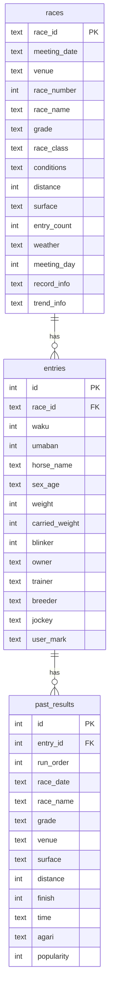

# 競馬新聞馬柱表示アプリ データ設計書

| 項目 | 内容 |
| ---- | ---- |
| 文書名 | データ設計書 |
| 対象システム | 競馬新聞馬柱表示アプリ |
| 参照要件 | [RDD.md](../01_requirement/RDD.md) §4.2、§6 |
| 関連設計 | [基本設計書](./design.md)、[DataDifinition.md](./DataDifinition.md) |
| 版数 | 0.1.0 |
| 最終更新 | 2026-05-24 |

---

## 1. 概要

### 1.1. 目的

本書は、アプリが扱うデータの**永続化方針・論理モデル・物理スキーマ・外部フォーマット・DTO**を定義する。画面・処理の設計は [基本設計書](./design.md) を参照する。

### 1.2. データストアの役割

[RDD §4.2](../01_requirement/RDD.md) および [基本設計書](./design.md) に整合する。

| ストア | 役割 | ランタイム参照 |
| ------ | ---- | -------------- |
| **SQLite** | 正（マスター）。レース・出走馬・過去走・ユーザー印 | あり |
| **JSON** | 取込・交換用。外部ツールからの投入 | 取込時のみ |

### 1.3. データの流れ


| フェーズ | 処理 |
| -------- | ---- |
| 初回／更新 | JSON パース → バリデーション → トランザクション UPSERT |
| 通常利用 | SQLite から読み取り。印のみ UI から更新 |
| エクスポート | MVP 対象外（将来 SQLite → JSON） |

### 1.4. DB ファイル配置

Tauri のアプリデータディレクトリ配下に単一ファイルを置く。

```
{app_data_dir}/keiba_viz.db
```

---

## 2. 論理データモデル

### 2.1. エンティティ一覧

| エンティティ | 説明 | RDD |
| ------------ | ---- | --- |
| Race | 1 レースの概要・条件 | 6.4 |
| Entry | 1 レースの出走馬 1 頭 | 6.5 |
| PastResult | 出走馬の過去 1 走（最大 5 件/頭） | 6.6 |

### 2.2. ER 図



### 2.3. カーディナリティ・制約

| 関係 | 制約 |
| ---- | ---- |
| Race : Entry | 1 : N（N = 出走頭数。通常 2〜18） |
| Entry : PastResult | 1 : 0〜5（`run_order` 1〜5） |
| Race 識別 | `(meeting_date, venue, race_number)` はユニーク |
| Entry 識別 | `(race_id, umaban)` はユニーク |
| ユーザー印 | `entries.user_mark` のみアプリが更新。他マスタ項目は JSON 取込で上書き |

---

## 3. 物理設計（SQLite）

### 3.1. スキーマ定義

マイグレーション配置先: `src-tauri/migrations/001_init.sql`（実装時）

```sql
-- races: レース概要 (RDD 6.4)
CREATE TABLE races (
  race_id       TEXT PRIMARY KEY,
  meeting_date  TEXT NOT NULL,          -- ISO 8601 日付 YYYY-MM-DD
  venue         TEXT NOT NULL,
  race_number   INTEGER NOT NULL,
  race_name     TEXT,
  grade         TEXT,
  race_class    TEXT,
  conditions    TEXT,
  distance      INTEGER,                -- メートル
  surface       TEXT,                   -- 芝 / ダ 等
  entry_count   INTEGER,
  weather       TEXT,
  meeting_day   INTEGER,                -- 開催日目（1日目=1）
  record_info   TEXT,
  trend_info    TEXT,
  created_at    TEXT DEFAULT (datetime('now')),
  updated_at    TEXT DEFAULT (datetime('now')),
  UNIQUE (meeting_date, venue, race_number)
);

-- entries: 出走馬 (RDD 6.5)
CREATE TABLE entries (
  id              INTEGER PRIMARY KEY AUTOINCREMENT,
  race_id         TEXT NOT NULL REFERENCES races(race_id) ON DELETE CASCADE,
  waku            INTEGER,
  umaban          INTEGER NOT NULL,
  horse_name      TEXT NOT NULL,
  sex_age         TEXT,
  weight          INTEGER,              -- 直近体重 kg
  carried_weight  INTEGER,              -- 斤量 kg
  blinker         INTEGER NOT NULL DEFAULT 0,  -- 0=なし 1=あり
  owner           TEXT,
  trainer         TEXT,
  breeder         TEXT,
  jockey          TEXT,
  user_mark       TEXT,                 -- 予想印 ◎○▲△☆消 または NULL
  created_at      TEXT DEFAULT (datetime('now')),
  updated_at      TEXT DEFAULT (datetime('now')),
  UNIQUE (race_id, umaban)
);

-- past_results: 過去走 (RDD 6.6)
CREATE TABLE past_results (
  id          INTEGER PRIMARY KEY AUTOINCREMENT,
  entry_id    INTEGER NOT NULL REFERENCES entries(id) ON DELETE CASCADE,
  run_order   INTEGER NOT NULL,         -- 1=直近 … 5=5走前
  race_date   TEXT,
  race_name   TEXT,
  grade       TEXT,
  venue       TEXT,
  surface     TEXT,
  distance    INTEGER,
  finish      INTEGER,                  -- 着順
  time        TEXT,                     -- 走破タイム 例 1:58.4
  agari       TEXT,                     -- 上がり 例 33.8
  popularity  INTEGER,
  UNIQUE (entry_id, run_order)
);

CREATE INDEX idx_races_meeting_date ON races(meeting_date);
CREATE INDEX idx_entries_race_id ON entries(race_id);
CREATE INDEX idx_past_results_entry_id ON past_results(entry_id);
```

### 3.2. カラム定義（一覧）

#### races

| カラム | 型 | NULL | 説明 |
| ------ | -- | ---- | ---- |
| race_id | TEXT | NO | 業務キー。例 `20260510_TOKYO_11` |
| meeting_date | TEXT | NO | 開催日 |
| venue | TEXT | NO | 競馬場名 |
| race_number | INTEGER | NO | R |
| race_name | TEXT | YES | レース名 |
| grade | TEXT | YES | G1 等 |
| race_class | TEXT | YES | クラス |
| conditions | TEXT | YES | 表示用条件文字列 |
| distance | INTEGER | YES | 距離（m） |
| surface | TEXT | YES | 馬場 |
| entry_count | INTEGER | YES | 出走頭数 |
| weather | TEXT | YES | 天気 |
| meeting_day | INTEGER | YES | 開催日目 |
| record_info | TEXT | YES | 同レースのレコード |
| trend_info | TEXT | YES | 同レースの傾向 |

#### entries

| カラム | 型 | NULL | 説明 |
| ------ | -- | ---- | ---- |
| id | INTEGER | NO | サロゲートキー（印更新で使用） |
| race_id | TEXT | NO | FK → races |
| waku | INTEGER | YES | 枠番 |
| umaban | INTEGER | NO | 馬番 |
| horse_name | TEXT | NO | 馬名 |
| sex_age | TEXT | YES | 性齢 例 `牡4` |
| weight | INTEGER | YES | 直近体重 |
| carried_weight | INTEGER | YES | 斤量 |
| blinker | INTEGER | NO | ブリンカー 0/1 |
| owner | TEXT | YES | 馬主 |
| trainer | TEXT | YES | 厩舎 |
| breeder | TEXT | YES | 生産牧場 |
| jockey | TEXT | YES | 騎手 |
| user_mark | TEXT | YES | ユーザー予想印 |

#### past_results

| カラム | 型 | NULL | 説明 |
| ------ | -- | ---- | ---- |
| id | INTEGER | NO | サロゲートキー |
| entry_id | INTEGER | NO | FK → entries |
| run_order | INTEGER | NO | 1〜5（小さいほど直近） |
| race_date | TEXT | YES | 過去走日付 |
| race_name | TEXT | YES | レース名 |
| grade | TEXT | YES | グレード |
| venue | TEXT | YES | 競馬場 |
| surface | TEXT | YES | 芝/ダ |
| distance | INTEGER | YES | 距離 |
| finish | INTEGER | YES | 着順 |
| time | TEXT | YES | 走破タイム |
| agari | TEXT | YES | 上がり |
| popularity | INTEGER | YES | 人気 |

### 3.3. マイグレーション方針

| 方針 | 内容 |
| ---- | ---- |
| ツール | `rusqlite` + バージョン管理 SQL、または `refinery` / 手動適用 |
| 初回 | `001_init.sql` で全テーブル作成 |
| 追加カラム | 新規 `00N_*.sql` を順次適用。既存 DB は起動時にマイグレート |
| 破壊的変更 | MVP では開発 DB 削除でよい。本番相当ではバックアップ後に移行スクリプト |

---

## 4. 外部データ（JSON 取込）

### 4.1. ファイル単位

| 項目 | 規約 |
| ---- | ---- |
| 単位 | **1 ファイル = 1 開催日** の全レース |
| 命名例 | `meeting_20260510.json` |
| 文字コード | UTF-8 |
| ルートキー | `meetingDate`, `races` |

### 4.2. JSON スキーマ（論理）

```json
{
  "meetingDate": "2026-05-10",
  "races": [
    {
      "raceId": "20260510_TOKYO_11",
      "venue": "東京",
      "raceNumber": 11,
      "raceName": "NHKマイルC",
      "grade": "G1",
      "raceClass": "",
      "conditions": "芝1600",
      "distance": 1600,
      "surface": "芝",
      "entryCount": 18,
      "weather": "晴",
      "meetingDay": 2,
      "recordInfo": "",
      "trendInfo": "",
      "entries": [
        {
          "waku": 1,
          "umaban": 1,
          "horseName": "サンプルホース",
          "sexAge": "牡4",
          "weight": 480,
          "carriedWeight": 57,
          "blinker": false,
          "owner": "馬主名",
          "trainer": "厩舎名",
          "breeder": "牧場名",
          "jockey": "騎手名",
          "pastResults": [
            {
              "raceDate": "2026-04-20",
              "raceName": "皐月賞",
              "grade": "G1",
              "venue": "中山",
              "surface": "芝",
              "distance": 2000,
              "finish": 2,
              "time": "1:58.4",
              "agari": "33.8",
              "popularity": 1
            }
          ]
        }
      ]
    }
  ]
}
```

### 4.3. JSON ↔ SQLite マッピング

| JSON パス | SQLite |
| --------- | ------ |
| `meetingDate` | `races.meeting_date`（各 race にも設定） |
| `races[].raceId` | `races.race_id` |
| `races[].venue` | `races.venue` |
| `races[].raceNumber` | `races.race_number` |
| `races[].raceName` | `races.race_name` |
| `races[].grade` | `races.grade` |
| `races[].raceClass` | `races.race_class` |
| `races[].conditions` | `races.conditions` |
| `races[].distance` | `races.distance` |
| `races[].surface` | `races.surface` |
| `races[].entryCount` | `races.entry_count` |
| `races[].weather` | `races.weather` |
| `races[].meetingDay` | `races.meeting_day` |
| `races[].recordInfo` | `races.record_info` |
| `races[].trendInfo` | `races.trend_info` |
| `entries[].waku` | `entries.waku` |
| `entries[].umaban` | `entries.umaban` |
| `entries[].horseName` | `entries.horse_name` |
| `entries[].sexAge` | `entries.sex_age` |
| `entries[].weight` | `entries.weight` |
| `entries[].carriedWeight` | `entries.carried_weight` |
| `entries[].blinker` | `entries.blinker`（bool → 0/1） |
| `entries[].owner` | `entries.owner` |
| `entries[].trainer` | `entries.trainer` |
| `entries[].breeder` | `entries.breeder` |
| `entries[].jockey` | `entries.jockey` |
| `entries[].pastResults[]` | `past_results`（配列 index+1 → `run_order`） |

**取込時に触らない列**: `entries.user_mark`（既存レース再取込時は既存印を保持するか、設計判断で上書き null — **MVP は再取込でも `user_mark` を保持**）

### 4.4. 取込処理ルール

| ルール | 内容 |
| ------ | ---- |
| 重複 race_id | UPSERT（レース・出走馬・過去走を差し替え） |
| pastResults 件数 | 最大 5。超過分は切り捨て |
| pastResults 順序 | 配列先頭 = 直近 = `run_order` 1 |
| 必須項目 | `meetingDate`, `races`, 各 `raceId`, `venue`, `raceNumber`, 各 `umaban`, `horseName` |
| 失敗時 | トランザクション全体をロールバック |

### 4.5. バリデーション（取込時）

| チェック | エラー扱い |
| -------- | ---------- |
| JSON 構文不正 | 取込中止 |
| `raceId` 重複（同一ファイル内） | 取込中止 |
| `umaban` 重複（同一レース内） | 取込中止 |
| `pastResults` が 6 件以上 | 5 件に切り詰め（警告ログ） |
| 日付形式不正 | 警告ログ、NULL 格納可 |

---

## 5. RDD 表示項目との対応

### 5.1. レース一覧（RDD 6.2）

| 表示項目 | ソース |
| -------- | ------ |
| 開催日 | `races.meeting_date` |
| 競馬場 | `races.venue` |
| R | `races.race_number` |
| レース名 | `races.race_name` |
| 条件 | `races.conditions` または `surface` + `distance` + `grade` の合成 |

### 5.2. レース概要（RDD 6.4）

| 表示項目 | ソース |
| -------- | ------ |
| 開催日 | `meeting_date` |
| 競馬場 | `venue` |
| 開催日目 | `meeting_day` |
| 天気 | `weather` |
| レース名 | `race_name` |
| グレード | `grade` |
| クラス | `race_class` |
| 条件 | `conditions` |
| 距離 | `distance` |
| 馬場 | `surface` |
| 出走頭数 | `entry_count` |
| 同レースのレコード | `record_info` |
| 同レースの傾向 | `trend_info` |

### 5.3. 馬柱（RDD 6.5）

| 表示項目 | ソース |
| -------- | ------ |
| 印 | `entries.user_mark` |
| 枠番 | `waku` |
| 馬番 | `umaban` |
| 馬名 | `horse_name` |
| 性齢 | `sex_age` |
| 直近体重 | `weight` |
| 斤量 | `carried_weight` |
| ブリンカー | `blinker` |
| 馬主 | `owner` |
| 厩舎 | `trainer` |
| 生産牧場 | `breeder` |
| 騎手 | `jockey` |
| 過去5走 | `past_results` WHERE `run_order` IN (1..5) |

### 5.4. 過去走セル（RDD 6.6）

| 表示項目 | ソース |
| -------- | ------ |
| 日付 | `past_results.race_date` → 表示 `M/D` |
| レース名 | `race_name` |
| グレード | `grade` |
| 競馬場 | `venue` |
| 馬場 | `surface` |
| 距離 | `distance` |
| 着順 | `finish` |
| 走破タイム | `time` |
| 上がりタイム | `agari` |
| 人気 | `popularity` |

### 5.5. 予想印（RDD 6.8）

| 値 | 意味 | 格納値 |
| -- | ---- | ------ |
| ◎ | 本命 | そのまま Unicode 文字列 |
| ○ | 対抗 | 同上 |
| ▲ | 単穴 | 同上 |
| △ | 連下 | 同上 |
| ☆ | 穴 | 同上 |
| 消 | 消し | 同上 |
| （未選択） | — | `NULL` |

---

## 6. アプリケーション層の型（DTO）

Tauri IPC および React で使用する型。DB の snake_case は API 境界で camelCase に変換する。

### 6.1. 一覧・詳細

```typescript
/** レース一覧行 (RDD 6.2) */
type RaceSummary = {
  raceId: string;
  meetingDate: string;
  venue: string;
  raceNumber: number;
  raceName: string;
  conditions: string;
};

/** レース概要 (RDD 6.4) */
type RaceDetail = {
  raceId: string;
  meetingDate: string;
  venue: string;
  raceNumber: number;
  raceName: string;
  grade: string | null;
  raceClass: string | null;
  conditions: string | null;
  distance: number | null;
  surface: string | null;
  entryCount: number | null;
  weather: string | null;
  meetingDay: number | null;
  recordInfo: string | null;
  trendInfo: string | null;
};
```

### 6.2. 出走馬・過去走（馬柱）

```typescript
/** 過去1走 (RDD 6.6) */
type PastRace = {
  raceDate: string | null;
  raceName: string | null;
  grade: string | null;
  venue: string | null;
  surface: string | null;
  distance: number | null;
  finish: number | null;
  time: string | null;
  agari: string | null;
  popularity: number | null;
};

/** 馬柱1行 (RDD 6.5) */
type EntryWithPast = {
  id: number;
  waku: number | null;
  umaban: number;
  horseName: string;
  sexAge: string | null;
  weight: number | null;
  carriedWeight: number | null;
  blinker: boolean;
  owner: string | null;
  trainer: string | null;
  breeder: string | null;
  jockey: string | null;
  userMark: string | null;
  pastResults: PastRace[];
};
```

### 6.3. 取込結果

```typescript
type ImportResult = {
  meetingDate: string;
  racesImported: number;
  entriesImported: number;
  warnings: string[];
};
```

### 6.4. 将来拡張（MVP 非表示）

RDD 馬柱に無いが [DataDifinition.md](./DataDifinition.md) にあった項目。DB・JSON には将来追加可能。

| 項目 | 想定カラム | 備考 |
| ---- | ---------- | ---- |
| オッズ | `entries.odds` | 実装時マイグレーション |
| 当日人気 | `entries.popularity` | 過去走の `popularity` と名前衝突に注意 |

---

## 7. 表示フォーマット規則

| 種別 | DB 保存 | 画面表示 |
| ---- | ------- | -------- |
| 開催日 | `YYYY-MM-DD` | `YYYY/MM/DD` |
| 過去走日付 | `YYYY-MM-DD` 推奨 | `M/D`（例 `4/20`） |
| 走破タイム | 文字列 `分:秒.小数` | そのまま |
| 上がり | 文字列 | そのまま |
| 着順 | 整数 | `N着` |
| 人気 | 整数 | `N人気` |
| 斤量 | 整数 kg | そのまま or `57kg` |
| 体重欠損 | `NULL` | `—` 等 |
| 過去走不足 | 行なし | 空セル（0〜4 走） |

---

## 8. 参照整合性と削除

| 操作 | 挙動 |
| ---- | ---- |
| レース削除（将来） | `ON DELETE CASCADE` で entries → past_results 連鎖削除 |
| 再取込 UPSERT | 同一 `race_id` の entries を一旦削除して再 INSERT、または entry 単位 UPSERT（実装選択） |
| 印のみ更新 | `UPDATE entries SET user_mark=?, updated_at=datetime('now') WHERE id=?` |

---

## 9. 未決定・要確認

| ID | 項目 | 暫定 |
| -- | ---- | ---- |
| D-01 | 再取込時の `user_mark` | 保持（印を消さない） |
| D-02 | `odds` / 当日人気のカラム追加 | MVP では未実装 |
| D-03 | JSON エクスポート形式 | 未定義 |
| D-04 | `analysis` 独自指標の格納 | 将来 `races.analysis_json` 等 |

---

## 10. 改訂履歴

| 版 | 日付 | 内容 |
| -- | ---- | ---- |
| 0.1.0 | 2026-05-24 | 初版（基本設計書 §5 より分離） |
