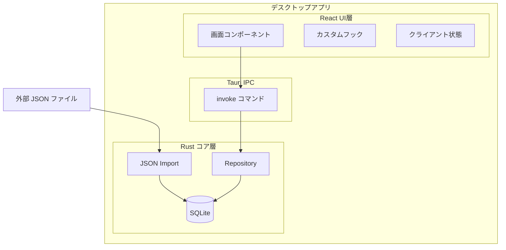
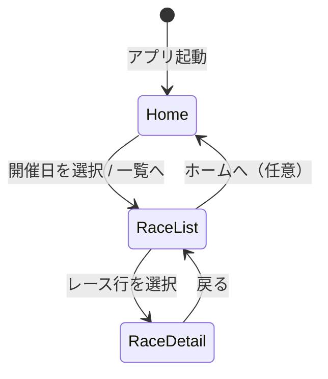

# 競馬新聞馬柱表示アプリ 基本設計書

| 項目 | 内容 |
| ---- | ---- |
| 文書名 | 基本設計書 |
| 対象システム | 競馬新聞馬柱表示アプリ |
| 参照要件 | [RDD.md](../01_requirement/RDD.md) |
| 関連設計 | [README.md](./README.md)、[データ設計書](./dataDesign.md)、[DataDifinition.md](./DataDifinition.md) |
| 版数 | 0.1.0 |
| 最終更新 | 2026-05-24 |

---

## 1. 設計方針

### 1.1. 目的

本書は [RDD](../01_requirement/RDD.md) に基づき、実装に必要な**構成・画面・データ・処理の骨格**を定義する。詳細な UI 部品や CSS は別途 UI 設計（[UI/](./UI/)）で補完する。

### 1.2. 設計原則

| 原則 | 内容 |
| ---- | ---- |
| オフライン前提 | データはユーザーローカルのみ。外部 API 通信は行わない |
| SQLite を正とする | 表示・更新の単一データソースは SQLite。JSON は取込専用 |
| 関心の分離 | UI（React）／永続化・取込（Rust）／型定義（共有またはフロント）を分離 |
| MVP 優先 | RDD で未定義の項目は設計判断として暫定定義し、**要確認**として明記する |

### 1.3. スコープ

| 区分 | 内容 |
| ---- | ---- |
| 対象（MVP） | レース一覧・詳細、馬柱・過去走、印入力、ソート・フィルタ、印刷 |
| 対象外（MVP） | JSON エクスポート、クラウド同期、複数ユーザー、外部データ自動取得 |
| 将来 | SQLite → JSON エクスポート、レース分析の独自指標拡張 |

---

## 2. システム構成

### 2.1. 技術スタック

[設計 README](./README.md) に準拠する。

| 層 | 技術 | 役割 |
| ---- | ---- | ---- |
| シェル | Tauri 2.x | デスクトップウィンドウ、Rust ↔ WebView ブリッジ |
| フロントエンド | React 19 + TypeScript + Vite | 画面・状態管理・印刷用 DOM |
| バックエンド | Rust | SQLite アクセス、JSON 取込、ファイルパス解決 |
| 永続化 | SQLite 3 | レース・出走馬・過去走・ユーザー印 |

### 2.2. 論理構成



### 2.3. ディレクトリ構成（案）

```
KEIBA_visualize_app/
├── src-tauri/                 # Rust バックエンド
│   ├── src/
│   │   ├── main.rs
│   │   ├── commands/          # Tauri コマンド
│   │   ├── db/                # 接続・マイグレーション
│   │   ├── models/            # DB エンティティ
│   │   ├── repository/        # CRUD
│   │   └── import/            # JSON パース・取込
│   └── migrations/            # SQL スキーマ
├── src/                       # React フロントエンド
│   ├── pages/                 # 画面単位
│   ├── components/            # 馬柱・一覧など
│   ├── hooks/                 # データ取得・ソート・フィルタ
│   ├── types/                 # UI 用型（dataDesign.md と整合）
│   └── lib/                   # 印順・フォーマット等
├── doc/
└── data/                      # 開発用サンプル JSON（任意）
```

---

## 3. 画面設計

### 3.1. 画面一覧と RDD 対応

| 画面 ID | 画面名 | RDD | 概要 |
| ------- | ------ | --- | ---- |
| SCR-01 | ホーム | 5.1 | 起動直後。開催日選択またはレース一覧への導線 |
| SCR-02 | レース一覧 | 5.1 / 6.2 | 開催レースの一覧 |
| SCR-03 | レース詳細 | 5.1 / 6.3〜6.11 | 概要・馬柱・分析・印操作 |

### 3.2. 画面遷移

RDD に遷移の詳細がないため、以下を**設計判断（要確認）**とする。



| 遷移 | トリガー | 保持する状態 |
| ---- | -------- | ------------ |
| Home → RaceList | 「レース一覧」または開催日カード選択 | 選択した `meeting_date` |
| RaceList → RaceDetail | 行クリック | `race_id` |
| RaceDetail → RaceList | ヘッダ「戻る」 | 一覧のスクロール位置（可能なら） |

**SCR-01 ホーム（暫定）**

- 起動時に SQLite から**開催日の一覧**（distinct）を取得し、日付カードを表示する
- カード選択で SCR-02 へ遷移（該当日のレースのみ表示）
- データ未取込時は「JSON を取り込んでください」＋取込ボタンを表示

### 3.3. レース詳細レイアウト

縦積み＋馬柱は横スクロール可能とする（新聞幅を想定）。

```
┌─────────────────────────────────────────┐
│ ヘッダ: 戻る | 競馬場 R レース名          │
├─────────────────────────────────────────┤
│ レース概要パネル (6.4)                    │
├─────────────────────────────────────────┤
│ レース分析パネル (6.7) ※MVPは印サマリのみ │
├─────────────────────────────────────────┤
│ ツールバー: ソート | フィルタ | 印刷       │
├─────────────────────────────────────────┤
│ 馬柱テーブル (6.5 / 6.6) ← 横スクロール   │
└─────────────────────────────────────────┘
```

---

## 4. 機能設計

### 4.1. 機能とコンポーネント対応

| RDD 機能 | 処理概要 | 主担当 |
| -------- | -------- | ------ |
| 6.2 レース一覧 | `list_races` で取得、日付・競馬場・R でソート | `RaceListPage` |
| 6.3〜6.4 概要 | `get_race` でレース＋メタ取得 | `RaceSummaryPanel` |
| 6.5〜6.6 馬柱 | `list_entries` で出走馬＋過去走 | `UmabaTable` |
| 6.7 分析 | MVP: 印の集計表示のみ | `RaceAnalysisPanel` |
| 6.8 印入力 | セレクト変更 → `update_mark` | `MarkSelect` |
| 6.9 ソート | クライアント側で配列ソート | `useUmabaSort` |
| 6.10 フィルタ | クライアント側でフィルタ | `useUmabaFilter` |
| 6.11 印刷 | `@media print` + 印刷用 DOM | `PrintLayout` |

### 4.2. JSON 取込

| 項目 | 設計 |
| ---- | ---- |
| トリガー | ホームまたはメニューから「データ取込」→ ファイルダイアログ |
| 形式 | 1 ファイル = 1 開催日分のレース配列（[§5.3](#53-json-取込フォーマット)） |
| 処理 | パース → バリデーション → トランザクションで UPSERT |
| 失敗時 | エラーメッセージ表示、DB はロールバック |
| 重複 | 同一 `race_id` は上書き更新（出走馬・過去走も再投入） |

### 4.3. 予想印入力（6.8）

| 項目 | 設計 |
| ---- | ---- |
| UI | 馬柱「印」列に `<select>`（空 / ◎ / ○ / ▲ / △ / ☆ / 消） |
| 保存 | 変更時に即 `update_mark`（デバウンス 300ms 可） |
| 永続化 | `entry.user_mark` に SQLite 保存 |
| ルール（暫定） | 1 レースに ◎ は 1 頭まで。2 頭目を ◎ にしたら前の ◎ をクリア（要確認） |
| 分析との関係 | ユーザー入力印のみ。将来「独自指標」列を追加可能 |

**印の優先順（ソート用）**

```
◎(1) → ○(2) → ▲(3) → △(4) → ☆(5) → 消(6) → 未設定(99)
```

### 4.4. ソート（6.9）

| 条件 | 一次キー | 二次キー（暫定） |
| ---- | -------- | ---------------- |
| 印順 | 上記優先順 | 馬番昇順 |
| 馬番順 | 馬番昇順 | — |

昇順／降順: MVP は**昇順固定**。UI に昇降トグルは将来追加（要確認）。

### 4.5. フィルタ（6.10）

| 条件 | 設計 |
| ---- | ---- |
| 印 | チェックボックス複数選択、**OR 条件**（いずれかの印を持つ馬を表示） |
| 未設定 | 「印なし」を含めるチェック（デフォルト ON） |

### 4.6. 印刷（6.11）

| 項目 | 設計 |
| ---- | ---- |
| 対象 | レース概要 + 馬柱（フィルタ・ソート後の表示内容） |
| 除外 | ツールバー、分析パネル、印セレクト（印の**文字**は印刷に含める） |
| 方式 | ブラウザ `window.print()` + 印刷用 CSS |
| 用紙 | A4 縦（要確認）、余白 10mm |
| PDF | OS の「PDF に保存」に委ねる（専用 PDF 生成は MVP 対象外） |

### 4.7. レース分析表示（6.7）

RDD 6.7.2 が空のため、MVP では以下に限定する（**要確認**）。

| 項目 | 内容 |
| ---- | ---- |
| 印の頭数集計 | ◎○▲△☆消 ごとの頭数 |
| 表示位置 | レース詳細・概要の下 |

独自指標は JSON フィールド `analysis`（任意）を将来表示する拡張点として残す。

---

## 5. データ設計

データの永続化・スキーマ・JSON 取込・DTO の詳細は **[データ設計書](./dataDesign.md)** に記載する。

| 項目 | 概要 |
| ---- | ---- |
| 正データ | SQLite（`{app_data_dir}/keiba_viz.db`） |
| 外部投入 | JSON（1 開催日 = 1 ファイル） |
| 主要エンティティ | `races` / `entries` / `past_results` |
| UI 向け型 | `RaceSummary`, `RaceDetail`, `EntryWithPast`, `PastRace` |

---

## 6. インターフェース設計（Tauri IPC）

### 6.1. コマンド一覧

| コマンド | 引数 | 戻り値 | 用途 |
| -------- | ---- | ------ | ---- |
| `import_json` | `path: string` | `ImportResult` | JSON 取込 |
| `list_meeting_dates` | — | `string[]` | ホーム用開催日一覧 |
| `list_races` | `meeting_date: string` | `RaceSummary[]` | レース一覧 |
| `get_race` | `race_id: string` | `RaceDetail` | レース概要 |
| `list_entries` | `race_id: string` | `EntryWithPast[]` | 馬柱データ |
| `update_mark` | `entry_id, mark` | `void` | 印更新 |

### 6.2. 型（DTO）

Tauri コマンドの戻り値・引数に用いる型定義は [データ設計書 §6](./dataDesign.md#6-アプリケーション層の型dto) を参照。

---

## 7. 非機能要件の設計方針

RDD 7章は「なし」のため、実装目標を以下に暫定定義する（**要確認**）。

| 項目 | 目標 |
| ---- | ---- |
| 対応 OS | Windows 10/11（開発・主要ターゲット）。macOS は Tauri ビルドで対応可能とする |
| オフライン | 必須。ネットワーク不要 |
| 性能 | 1 開催日・12R・各 18 頭×5 走で一覧表示 1 秒以内（目安） |
| データ量 | 単一 SQLite 100MB 未満を想定 |
| セキュリティ | データ外部送信なし。取込パスはユーザー選択のみ |
| ログ | Rust `tracing` でファイルログ（エラー・取込結果） |
| 言語 | UI 日本語固定 |

---

## 8. エラー・例外

| 状況 | UI 挙動 |
| ---- | ------- |
| DB 未作成・レース 0 件 | ホームに取込案内 |
| JSON パース失敗 | トースト「ファイル形式が不正です」 |
| 取込中 | モーダルまたはスピナー、二重取込防止 |
| `get_race` 失敗 | 詳細画面にエラーメッセージ＋一覧へ戻る |
| 過去走 0〜4 件 | 該当セルを空欄。5 走未満表記は不要 |

---

## 9. UI 設計との関係

| 成果物 | パス | 用途 |
| ------ | ---- | ---- |
| 馬柱レイアウト | [UI/馬柱.drawio](./UI/馬柱.drawio) | 列構成・新聞風レイアウトの参考 |
| 過去走セル | [UI/馬柱_過去成績.drawio](./UI/馬柱_過去成績.drawio) | 1 レース = 1 セルの内部レイアウト |

**モックと RDD の差分**

| モック要素 | 扱い |
| ---------- | ---- |
| 5走サマリ / 全走サマリ | MVP 対象外。将来 `past_results` の集計列として追加可能 |

---

## 10. 受入観点（設計レベル）

実装完了の判断に用いる主要シナリオ。

1. JSON を取込後、ホームに開催日が表示され、レース一覧で RDD 6.2 の項目が見える
2. レースを選択すると概要（6.4）・馬柱（6.5）・過去 5 走（6.6）が表示される
3. 印をセレクトで変更し、再起動後も同じ印が残る
4. 印順・馬番順で並び替え、印フィルタで該当馬のみ表示できる
5. 印刷プレビューで概要と馬柱がレイアウト崩れなく出力される

---

## 11. 未決定・要確認事項

RDD または要件レビューで未確定の項目。製品判断後に RDD / 本設計を更新する。

| ID | 項目 | 現設計での暫定 |
| -- | ---- | ------------- |
| O-01 | ホームを省略し起動直後に一覧へ | ホームで開催日選択 |
| O-02 | ◎ の重複禁止ルール | 1 レース 1 ◎、上書き時に他馬クリア |
| O-03 | レース分析の独自指標 | MVP は印集計のみ |
| O-04 | ソート昇降・二次条件の UI | 昇順固定、印→馬番 |
| O-05 | 5走サマリ / 全走サマリ | 対象外 |
| O-06 | macOS / Linux の正式サポート | Windows 優先 |
| O-07 | `odds` / `popularity` の馬柱表示 | MVP 非表示 |

---

## 12. 改訂履歴

| 版 | 日付 | 内容 |
| -- | ---- | ---- |
| 0.1.0 | 2026-05-24 | 初版作成（RDD 0.x 準拠） |
| 0.1.1 | 2026-05-24 | データ設計を [dataDesign.md](./dataDesign.md) に分離 |
