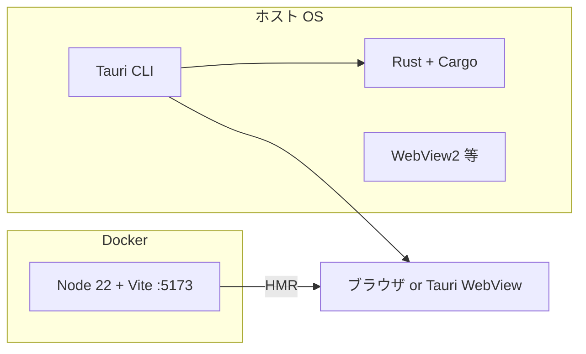

# 開発環境構築手順

| 項目 | 内容 |
| ---- | ---- |
| 対象 | 競馬新聞馬柱表示アプリ |
| 技術スタック | Tauri 2.x / React 19 + TypeScript + Vite / Rust / SQLite |
| 参照 | [基本設計書](./design.md)、[設計 README](./README.md) |

---

## 1. 開発環境の構成方針

本プロジェクトは **Docker + ホスト OS** のハイブリッド構成とする。

| 領域 | 実行場所 | 理由 |
| ---- | -------- | ---- |
| React（Vite 開発サーバー） | **Docker** | Node 版数の統一、依存の隔離 |
| Rust / Tauri（ビルド・デスクトップ起動） | **ホスト OS** | GUI・WebView2・ネイティブツールチェーンが必要 |
| SQLite | **ホスト（Tauri 実行時）** | アプリデータは Tauri の `app_data_dir` に配置 |

> Tauri の `tauri dev` をコンテナ内で動かすことは、ディスプレイ・OS 依存のため **推奨しない**（Linux + X11 転送は可能だが Windows/macOS 開発では非現実的）。



---

## 2. 前提条件

### 2.1. 共通

| ツール | 推奨バージョン | 用途 |
| ------ | -------------- | ---- |
| Git | 最新 | ソース管理 |
| Docker Desktop | 4.x 以降 | React 開発コンテナ |
| Docker Compose | v2（`docker compose`） | コンテナ起動 |

### 2.2. ホスト（Tauri / Rust 用）

#### Windows（主要ターゲット）

| ツール | 備考 |
| ------ | ---- |
| [Rust](https://www.rust-lang.org/tools/install)（rustup） | stable ツールチェーン |
| [Visual Studio Build Tools](https://visualstudio.microsoft.com/visual-cpp-build-tools/) | 「C++ によるデスクトップ開発」ワークロード |
| [WebView2 Runtime](https://developer.microsoft.com/microsoft-edge/webview2/) | Tauri 2 の表示エンジン（多くの環境で既に入っている） |
| [Tauri 前提パッケージ](https://v2.tauri.app/start/prerequisites/) | 上記を満たすこと |

#### macOS / Linux

[Tauri 2 公式の Prerequisites](https://v2.tauri.app/start/prerequisites/) に従ってインストールする。

### 2.3. バージョン目安

| コンポーネント | 目安 |
| -------------- | ---- |
| Node.js（コンテナ内） | 22.x（`docker/node/Dockerfile`） |
| Rust | stable（`rustup default stable`） |
| Tauri CLI | 2.x（`cargo install tauri-cli --version "^2"` または `npm` 経由） |

---

## 3. リポジトリの取得

```bash
git clone https://github.com/<owner>/KEIBA_visualize_app.git
cd KEIBA_visualize_app
```

以降、パスはリポジトリルートを基準とする。

---

## 4. Docker による React 開発環境

### 4.1. 構成ファイル

| ファイル | 役割 |
| -------- | ---- |
| [docker-compose.yaml](../../docker-compose.yaml) | `react-app` サービス定義 |
| [docker/node/Dockerfile](../../docker/node/Dockerfile) | Node 22 Alpine イメージ |

`react-app` サービスの要点:

- イメージ: `node:22-alpine` + git / curl / bash
- 作業ディレクトリ: `/app`（リポジトリ全体をマウント）
- ポート: `5173`（Vite デフォルト）
- 環境変数: `HOST=0.0.0.0`（コンテナ外からアクセス可能にする）

### 4.2. コンテナの起動

```bash
docker compose up -d --build
```

状態確認:

```bash
docker compose ps
```

### 4.3. コンテナに入る

```bash
docker compose exec react-app bash
```

プロンプトが `/app` になれば、リポジトリルートがマウントされている。

### 4.4. フロントエンドの初回セットアップ

Tauri プロジェクト未作成の場合は、**ホストまたはコンテナのどちらか一方**で 1 回だけ実行する（推奨: コンテナ内）。

#### パターン A: Tauri テンプレートから一式作成（推奨）

ホストで Rust が入っている場合:

```bash
# リポジトリルートで実行
npm create tauri-app@latest . -- --template react-ts
```

既存の `doc/` 等があるため、対話では **既存ディレクトリへの上書きを避ける**か、別名フォルダに作成後に `src/`・`src-tauri/` 等をマージする。

#### パターン B: Vite のみ先に Docker で起動（UI のみ確認）

コンテナ内:

```bash
cd /app
npm create vite@latest . -- --template react-ts
npm install
npm run dev -- --host 0.0.0.0
```

ブラウザで [http://localhost:5173](http://localhost:5173) を開く。

### 4.5. 日常のフロントエンド開発

```bash
# 1. コンテナ起動（未起動の場合）
docker compose up -d

# 2. コンテナ内で dev サーバー
docker compose exec react-app bash
npm install          # package.json 変更時
npm run dev -- --host 0.0.0.0
```

`package.json` の `scripts.dev` に `--host 0.0.0.0` を常時含めてもよい。

### 4.6. コンテナの停止・削除

```bash
# 停止
docker compose stop

# 停止 + コンテナ削除
docker compose down

# イメージも作り直す場合
docker compose down --rmi local
docker compose up -d --build
```

---

## 5. ホストによる Rust / Tauri 開発環境

### 5.1. Rust ツールチェーン

```bash
# 未導入の場合（https://rustup.rs/）
rustup default stable
rustup update

rustc --version
cargo --version
```

### 5.2. Tauri CLI

いずれか一方でよい。

```bash
# Cargo 経由
cargo install tauri-cli --locked

# または devDependency（プロジェクト作成後）
npm install
```

### 5.3. プロジェクトの依存取得（Rust）

`src-tauri/` が存在する場合、リポジトリルートまたは `src-tauri` で:

```bash
cd src-tauri
cargo fetch
```

### 5.4. Tauri 開発モード（デスクトップアプリ起動）

リポジトリルートで:

```bash
npm install
npm run tauri dev
```

- 初回は Rust クレートのビルドに数分かかることがある
- フロントは Vite に接続される（Tauri 既定では `localhost:5173`）
- **Docker で Vite を動かしている場合**は、先にコンテナで `npm run dev` を起動してから `tauri dev` を実行する

### 5.5. リリースビルド

```bash
npm run tauri build
```

成果物は `src-tauri/target/release/bundle/` 配下（OS により exe / msi 等）。

---

## 6. 推奨開発フロー

### 6.1. UI のみ（ブラウザ）

1. `docker compose up -d`
2. コンテナ内で `npm run dev -- --host 0.0.0.0`
3. ブラウザで `http://localhost:5173`

※ Tauri API（`invoke`）はモックが必要。IPC 未実装部分の確認向け。

### 6.2. フルスタック（Tauri + React）

| ターミナル | 作業 |
| ---------- | ---- |
| A（Docker） | `docker compose up -d` → `npm run dev -- --host 0.0.0.0` |
| B（ホスト） | `npm run tauri dev` |

または、Tauri が内包する Vite 起動に任せ、**Docker を使わずホストのみ**で `npm run tauri dev` だけでもよい（シンプル）。

### 6.3. SQLite の確認

開発中の DB は OS ごとに Tauri のアプリデータディレクトリに作成される（[データ設計書 §1.4](./dataDesign.md#14-db-ファイル配置)）。

| OS | 目安パス |
| -- | -------- |
| Windows | `%APPDATA%\com.<identifier>.<app>\` |
| macOS | `~/Library/Application Support/com.<identifier>.<app>/` |
| Linux | `~/.local/share/com.<identifier>.<app>/` |

`<identifier>` は `src-tauri/tauri.conf.json` の `identifier` に依存する。

GUI ツール例: [DB Browser for SQLite](https://sqlitebrowser.org/)

---

## 7. ディレクトリと Docker マウント

```
KEIBA_visualize_app/          ← ホスト（Git 作業ツリー）
├── docker/
│   └── node/Dockerfile
├── docker-compose.yaml
├── src/                      ← React（コンテナから編集可）
├── src-tauri/                ← Rust（ホストでビルド推奨）
├── doc/
└── data/                     ← サンプル JSON（任意）
```

- `volumes: .:/app` により、ホストで編集したファイルがコンテナに即反映される
- `node_modules` はホストとコンテナで **OS が異なるとネイティブモジュールで不整合**になる場合がある  
  → 対策: `node_modules` をコンテナ内のみに置く（名前付きボリューム）か、**npm 操作はコンテナ内に統一**する

### 7.1. node_modules をコンテナ専用にする（任意・推奨）

`docker-compose.yaml` に以下を追加する案:

```yaml
volumes:
  - .:/app
  - node_modules:/app/node_modules

volumes:
  node_modules:
```

追加後:

```bash
docker compose down
docker compose up -d --build
docker compose exec react-app npm install
```

---

## 8. 環境変数

| 変数 | 設定場所 | 用途 |
| ---- | -------- | ---- |
| `HOST=0.0.0.0` | docker-compose | Vite を LAN/ホストから参照 |
| `RUST_LOG=debug` | ホストシェル | Rust ログ（開発時） |

`.env` を使う場合はリポジトリルートに置き、**秘密情報はコミットしない**（`.gitignore` に `.env` を追加）。

---

## 9. 動作確認チェックリスト

- [ ] `docker compose up -d` で `react-dev` が `running`
- [ ] コンテナ内 `npm run dev` で [http://localhost:5173](http://localhost:5173) が表示される
- [ ] ホストで `rustc --version` が成功する
- [ ] ホストで `npm run tauri dev` でデスクトップウィンドウが開く（`src-tauri` 作成後）
- [ ] JSON 取込後、SQLite にレースデータが入る（機能実装後）

---

## 10. トラブルシューティング

### ポート 5173 が使用中

```bash
# Windows PowerShell
netstat -ano | findstr :5173

# 別ポートで起動
npm run dev -- --host 0.0.0.0 --port 5174
```

`docker-compose.yaml` の `ports` も `"5174:5174"` に合わせて変更する。

### Docker でファイル変更が反映されない（Windows）

- Docker Desktop の Settings → Resources でファイル共有対象にプロジェクトドライブが含まれているか確認
- WSL2 バックエンド利用時は、リポジトリを WSL ファイルシステム上に置くと高速・安定しやすい

### `npm run tauri dev` で WebView / ビルドエラー（Windows）

- Visual Studio Build Tools の C++ ワークロードを再インストール
- WebView2 Runtime を最新に更新
- `rustup update` 後に再ビルド

### コンテナ内 `npm install` が遅い / 失敗する

```bash
docker compose exec react-app npm cache clean --force
docker compose exec react-app npm install
```

### Rust と Docker の Node で node_modules が壊れる

- **npm install / npm run dev は Docker 内に統一**する、または
- 上記 §7.1 の名前付きボリュームで `node_modules` を分離する

---

## 11. 関連ファイル一覧

| パス | 説明 |
| ---- | ---- |
| [docker-compose.yaml](../../docker-compose.yaml) | React 開発用 Compose |
| [docker/node/Dockerfile](../../docker/node/Dockerfile) | Node 22 開発イメージ |
| [design.md](./design.md) | 技術スタック・ディレクトリ構成 |
| [dataDesign.md](./dataDesign.md) | DB スキーマ・JSON・DTO |
| [doc/開発環境.md](../開発環境.md) | 旧メモ（本書を正とする） |

---

## 12. 改訂履歴

| 版 | 日付 | 内容 |
| -- | ---- | ---- |
| 0.1.0 | 2026-05-24 | 初版（Docker: React、ホスト: Tauri/Rust） |
